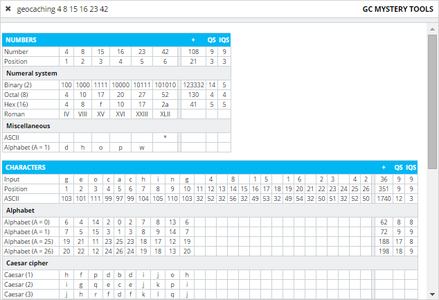

# GC Mystery Tools

A collection of utility functions used to solve common mystery geocaches.

 * [Live demo](https://darekkay.com/geocaching/)
 * [Blog post](http://darekkay.com/2015/10/18/puzzle-solving-tool-for-geocaching/)

## License

Copyright 2015 Darek Kay <darekkay@gmail.com>  

This project and its contents are open source under the [MIT license](LICENSE.txt).